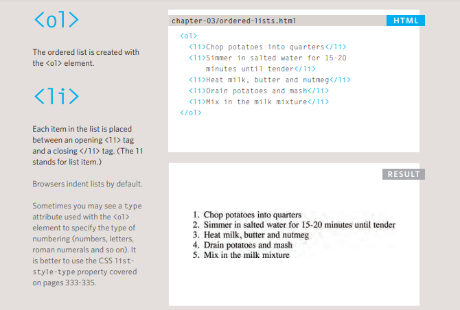
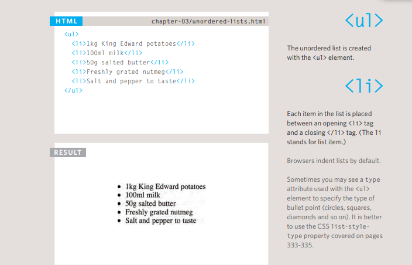
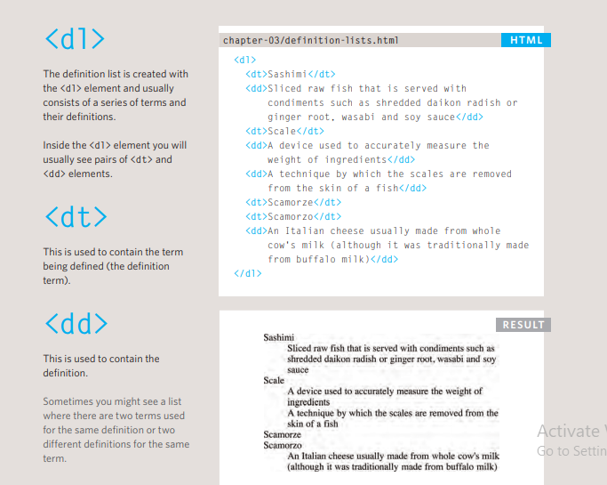
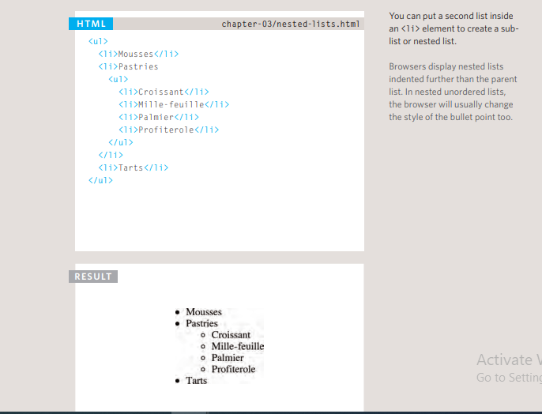
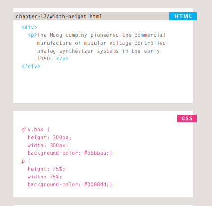
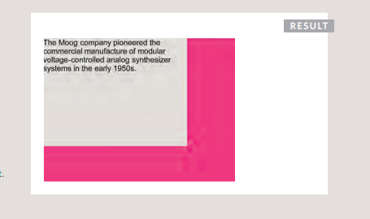
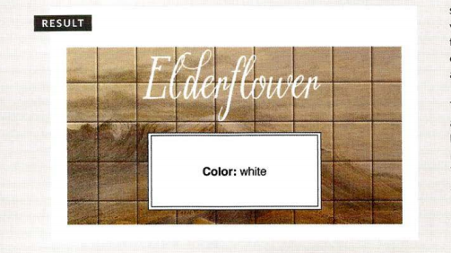
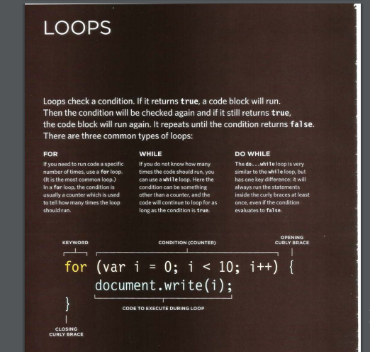

# Lists 
* ##### Ordered lists are lists where each item in the list is numbered. For example, the list might be a set of steps for a recipe that must be performed in order, or a legal contract where each point needs to be identified by a section number. 
* ##### Unordered lists are lists that begin with a bullet point (rather than characters that indicate order). 
* #####  Definition lists are made up of a set of terms along with the definitions for each of those terms
  
### Ordered lists 
  

### Unordered lists


### Definition Lists


### Nested lists


-------

# Boxes
### boxes dimensions <br/> width, height

##### By default a box is sized just big enough to hold its contents. To set your own dimensions for a box you can use the height and width properties.
##### The most popular ways to specify the size of a box are to use pixels, percentages, or ems. Traditionally, pixels have been the most popular method because they allow designers to accurately control their size. 
##### When you use percentages, the size of the box is relative to the size of the browser window or, if the box is encased within another box, it is a percentage of the size of the containing box. 
##### When you use ems, the size of the box is based on the size of text within it. Designers have recently started to use percentages and ems more for measurements as they try to create designs that are flexible across devices which have different-sized screens.
##### In the example on the right, you can see that a containing <div> element is used which is 300 pixels wide by 300 pixels high. Inside of this is a paragraph that is 75% of the width and height of the containing element. This means that the size of the paragraph is 225 pixels wide by 225 pixels high.



##### the result: 


### Limiting Width
#### min-width, max-width

```
html

<tr>
<td></td>
<td class="description">The Rhodes piano is an
 electro-mechanical piano, invented by Harold
 Rhodes during the fifties and later
 manufactured in a number of models ...</td>
<td>$1400</td>
</tr>
```
```
CSS

td.description {
min-width: 450px;
max-width: 650px;
text-align: left;
padding: 5px;
margin: 0px;}
```
### Overflowing Content
#### overflow
##### The overflow property tells the browser what to do if the content contained within a box is larger than the box itself. It can have one of two values: 
##### hidden This property simply hides any extra content that does not fit in the box 
##### scroll This property adds a scroll bar to the box so that users can scroll to see the missing content.
##### On the left, you can see two boxes whose contents expand beyond their set dimensions. The first example has the overflow property with a value of hidden. The second example has the overflow property with a value of scroll.
##### The overflow property is particularly handy because some browsers allow users to adjust the size of the text to appear as large or as small as they want. If the text is set too large then the page can become an unreadable mess. Hiding the overflow on such boxes helps prevent items overlapping on the page.
### CSS3: Elliptical Shapes
#### border-radius
##### To create more complex shapes, you can specify different distances for the horizontal and the vertical parts of the rounded corners.
##### For example, this will create a radius that is wider than it is tall: border-radius: 80px 50px;
```
html

<p class="one"></p>
<p class="two"></p>
<p class="three"></p>
```

```
CSS

p.one {
border-top-left-radius: 80px 50px;
-moz-border-radius-top-left: 80px 50px;
-webkit-border-radius-top-left: 80px 50px;}
p.two {
border-radius: 1em 4em 1em 4em / 2em 1em 2em 1em;
-moz-border-radius: 1em 4em 1em 4em
 / 2em 1em 2em 1em;
-webkit-border-radius: 1em 4em 1em 4em
 / 2em 1em 2em 1em;}
p.three {
padding: 0px;
border-radius: 100px;
-moz-border-radius: 100px;
-webkit-border-radius: 100px;}
```
-------
## Arrays
#### An array is a special type of variable. It doesn't just store one value; it stores a list of values. 
##### You should consider using an array whenever you are working with a list or a set of values that are related to each other.
##### Arrays are especially helpful when you do not know how many items a list will contain because, when you create the array, you do not need to specify how many values it will hold.
##### If you don't know how many items a list will contain, rather than creating enough variables for a long list (when you might only use a small percentage of them), using an array is considered a better solution. 
##### For example, an array can be suited to storing the individual items on a shopping list because it is a list of related items. 
##### Additionally, each time you write a new shopping list, the number of items on it may differ.
### CREATING AN ARRAY
##### You create an array and give it a name just like you would any other variable (using the var keyword followed by the name of the array). 
##### The values are assigned to the array inside a pair of square brackets, and each value is separated by a comma. The values in the array do not need to be the same data type, so you can store a string, a number and a Boolean all in the same array. This technique for creating an array is known as an array literal. It is usually the preferred method for creating an array. You can also write each value on a separate line:
```
colors= ['white',
'black',
'custom'];
```

```
Java scripts 

var colors;
colors ['white', 'black', ' custom'];
var el document.getElementByld('col ors');
el . textContent = col ors[O]; 
```


-------------

## SWITCH STATEMENTS 
##### A switch statement starts with a variable called the switch value. Each case indicates a possible value for this variable and the code that should run if the variable matches that value.

```
switch (level) {
case 'One ':
title= 'Level 1 ' ;
break;
case 'Two':
tit 1 e = ' Level 2 ' ;
break;
case ' Three' :
title = 'Level 3' ;
break ;
default :
title= 'Test';
break; 
}
```
##### IF ... ELSE
* There is no need to provide an else
option. (You can just use an if
statement.)
* With a series of if statements, they are
all checked even if a match has been found
(so it performs more slowly than switch).

##### SWITCH
* You have a default option that is run if
none of the cases match.
* If a match is found, that code is run; then
the break statement stops the rest of
the switch statement running (providing
better performance than multiple i f
statements).

### USING SWITCH STATEMENTS 
##### In this example, the purpose of the switch statement is to present the user with a different message depending on which level they are at. The message is stored in a variable called msg.

```
Java scripts 

var msg;
var level = 2;
II Message
11 Level
c04/js/switch-statement .js
/I Determine message based on level
switch (level) {
case 1:
msg = 'Good luck on the first test ' ;
break;
case 2:
msg = 'Second of three - keep going!';
break;
case 3:
msg = ' Final round, al most there!';
break;
default :
msg = 'Good l uck!';
break;
var el = document.getEl ementByld('answer');
el .textContent = msg; 
```
### CHECKING EQUALITY & EXISTENCE 
##### Because the presence of an object or array can be considered truthy, it is often used to check for the existence of an element within a page. 
##### A unary operator returns a result with just one operand. Here you can see an if statement checking for the presence of an element. If the element is found, the result is truthy, so the first set of code is run. If it is not found, the second set is run instead.
```
if (document .getElementByid('header')){ 
II Found: do something
}else {
II Not found: do something else
}
```
### SHORT CIRCUIT VALUES  
##### Logical operators are processed left to right. They short-circuit (stop) as soon as they have a result - but they return the value that stopped the processing (not necessarily true or fa 1 se). 
##### Logical operators will not always return true or false, because:
* They return the value that stopped processing.
* That value might have been treated as truthy or falsy although it was not a Boolean.
  

##### i used this book as a reference:
[JSbook](https://slack-files.com/files-pri-safe/TNGRRLUMA-F01VBUFKN3C/javascript_and_jquery_interactive_jon_du.pdf?c=1619472428-96c719feacff7a14)