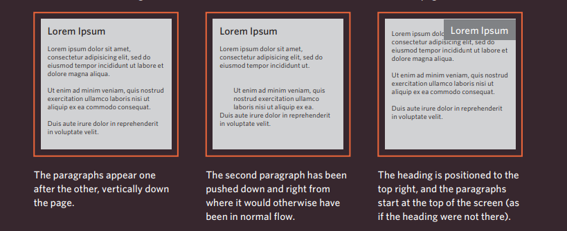

# html & css
## links 
##### Links are created using the < a> element. Users can click on anything between the opening < a> tag and the closing < /a> tag. You specify which page you want to link to using the href attribute
### Linking to Other Sites
####  < a>
##### Links are created using the < a> element which has an attribute called href. The value of the href attribute is the page that you want people to go to when they click on the link. Users can click on anything that appears between the opening < a> tag and the closing < /a> tag and will be taken to the page specified in the href attribute. When you link to a different website, the value of the hrefattribute will be the full web address for the site, which is known as an absolute URL.
```
<p>Movie Reviews:
<ul>
 <li><a href="http://www.empireonline.com">
 Empire</a></li>
 <li><a href="http://www.metacritic.com">
 Metacritic</a></li>
 <li><a href="http://www.rottentomatoes.com">
 Rotten Tomatoes</a></li>
 <li><a href="http://www.variety.com">
 Variety</a></li>
</ul>
</p
```
### Opening Links in a New Window 
##### target If you want a link to open in a new window, you can use the target attribute on the opening `<a>` tag. The value of this attribute should be _blank. 
##### One of the most common reasons a web page author might want a link to be opened in a new window is if it points to another website. In such cases, they hope the user will return to the window containing their site after finishing looking at the other one.
```
<a href="http://www.imdb.com" target="_blank">
Internet Movie Database</a> (opens in new window)
```

### Linking to a Specific Part of the Same Page
##### At the top of a long page you might want to add a list of contents that links to the corresponding sections lower down. Or you might want to add a link from part way down the page back to the top of it to save users from having to scroll back to the top.
##### Before you can link to a specific part of a page, you need to identify the points in the page that the link will go to. You do this using the id attribute (which can be used on every HTML element). You can see that the `<h1>` and `<h2>` elements in this example have been given id attributes that identify those sections of the page.
```
<h1 id="top">Film-Making Terms</h1>
<a href="#arc_shot">Arc Shot</a><br />
<a href="#interlude">Interlude</a><br />
<a href="#prologue">Prologue</a><br /><br />
<h2 id="arc_shot">Arc Shot</h2>
<p>A shot in which the subject is photographed by an
 encircling or moving camera</p>
<h2 id="interlude">Interlude</h2>
<p>A brief, intervening film scene or sequence, not
 specifically tied to the plot, that appears
 within a film</p>
<h2 id="prologue">Prologue</h2>
<p>A speech, preface, introduction, or brief scene
 preceding the the main action or plot of a film;
 contrast to epilogue</p>
<p><a href="#top">Top</a></p>
```
-------------------------------------------

## Layout 
#### Key Concepts in Positioning Elements

### building Blocks 
##### CSS treats each HTML element as if it is in its own box. This box will either be a block-level box or an inline box.

#### Containing Elements
##### If one block-level element sits inside another block-level element then the outer box is known as the containing or parent element.
#### Controlling the Position of Elements
##### CSS has the following positioning schemes that allow you to control the layout of a page: normal flow, relative positioning, and absolute positioning. You specify the positioning scheme using the position property in CSS. You can also float elements using the float property.
#### Normal flow 
##### Every block-level element appears on a new line, causing each item to appear lower down the page than the previous one.Even if you specify the width of the boxes and there is space for two elements to sit side-byside, they will not appear next to each other. This is the default behavior (unless you tell the browser to do something else)

#### Relative Positioning
##### This moves an element from the position it would be in normal flow, shifting it to the top, right bottom, or left of where it would have been placed. This does not affect the position of surrounding elements; they stay in the position they would be in in normal flow.
#### Absolute positioning
##### This positions the element in relation to its containing element. It is taken out of normal flow, meaning that it does not affect the position of any surrounding elements (as they simply ignore the space it would have taken up). Absolutely positioned elements move as users scroll up and down the page.

#### this picture bellow present the postioning


--------------------------------------

# Javascript
## WHAT IS A FUNCTION?
##### Functions let you group a series of statements together to perform a specific task. If different parts of a script repeat the same task, you can reuse the function (rather than repeating the same set of statements)
#### A BASIC FUNCTION
```
HTML
<!DOCTYPE html>
<html>
<head>
<ti t l e>Basic Function</title>
<l i nk rel ="stylesheet" href="css/ c03.css" />
</head>
<body>
<hl>TravelWorthy</ hl>
<div id="message">We lcome to our site! </ div>
<script src="js/ basic-function .js"></script>
</ body>
</ html> 
```
```
Javascript
var msg = 'Sign up to receive our newsletter for 10% off!';
function updateMessage() {
var el = document.getElementByld('message'};
el .textContent = msg;
}
updateMessage(}; 
```
