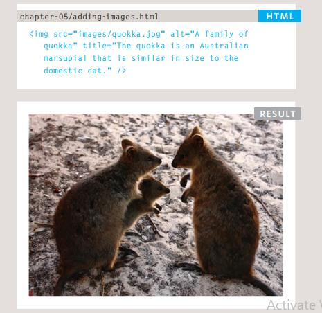
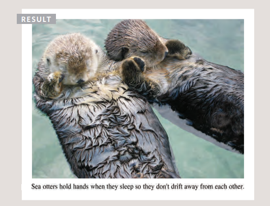
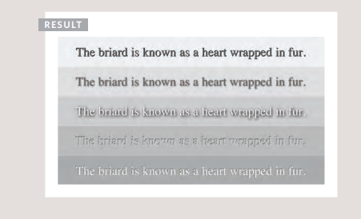

# HTML Images, Color and Text

## images
##### Several things to consider when selecting and preparing images for your site, but taking time to get them right will make it look more attractive and professional.
### Choosing Images
##### Images can be used to set the tone for a site in less time than it takes to read a description. If you do not have photographs to use on your website, there are companies who sell stock images; these are images you.
#### Images should:
* Be relevant
* Convey information
* Convey the right mood
* Be instantly recognisable
* Fit the color palette

##### pay to use (there is a list of stock photography websites below). Remember that all images are subject to copyright, and you can get in trouble for simply taking photographs from another website.

#### Stock photos
* www.istockphoto.com
* www.gettyimages.com
* www.veer.com
* www.sxc.hu
* www.fotolia.com

#### Online extra
##### We have provided an online gallery that helps you choose the right image for your website. You can find it in the tools section of the site accompanying this book.

### Adding Images
#### ``
##### To add an image into the page you need to use an `` element. This is an empty element (which means there is to closing tag). It must carry the following two attributes:

#### src
##### This tells the browser where it can find the image file. This will usually be a relative URL pointing to an image on your own site. (Here you can see that the images are in a child folder called images — relative URLs

#### alt
##### This provides a text description of the image which describes the image if you cannot see it.

#### title
##### You can also use the title attribute with the `` element to provide additional information about the image. Most browsers will display the content of this attribute in a tootip when the user hovers over the image.

``` 

 ```


### HTML5: Figure and Figure Caption 
##### `<figure>` Images often come with captions HTML5 has introduced a new `<figure>` element to contain images and their caption so that the two are associated. You can have more than one image inside the `<figure>` element as long as they all share the same caption. 
##### `<figcaption>` The `<figcaption>` element has been added to HTML5 in order to allow web page authors to add a caption to an image. Before these elements were created there was no way to associate an `` element with its caption.

```
<figure>

<br />
 <figcaption>Sea otters hold hands when they
 sleep so they don't drift away from each
 other.</figcaption>
</figure
```



#### References: [html book pages94-120](https://slack-files.com/files-pri-safe/TNGRRLUMA-F01VBUGB18S/html_css.pdf?c=1619302672-f49ad0e4e354c011)

----------------------------
----------------------------

## Color

### Color can really bring your pages to life.
### Foreground Color
#### the color property allows you to specify the color of text inside an element. You can specify any color in CSS in one of three ways:
* #### rgb values: These express colors in terms of how much red, green and blue are used to make it up. For example: rgb(100,100,90)
* #### hex codes: These are six-digit codes that represent the amount of red, green and blue in a color, preceded by a pound or hash # sign. For example: #ee3e80
* #### color names: There are 147 predefined color names that are recognized by browsers. For example: DarkCyan

### Contrast
#### When picking foreground and background colors, it is important to ensure that there is enough contrast for the text to be legible.
### low contrast:
#### Text is harder to read whenthere is low contrast between background and foreground colors. A lack of contrast is particularly a problem for those with visual impairments and color blindness. It also affects those with poor monitors and sunlight on their screens (which is increasingly common as people use handheld devices outdoors).
### high contrast:
#### Text is easier to read when there is higher contrast between background and foreground colors. If you want people to read a lot of text on your page, however, then too much contrast can make it harder to read, too.
### medium contrast:
#### For long spans of text, reducing the contrast a little bit improves readability. You can reduce contrast by using dark gray text on a white background or an off-white text on a dark background.

### CSS3: Opacity opacity, rgba 
##### CSS3 introduces the opacity property which allows you to specify the opacity of an element and any of its child elements. The value is a number between 0.0 and 1.0 (so a value of 0.5 is 50% opacity and 0.15 is 15% opacity). The CSS3 rgba property allows you to specify a color, just like you would with an RGB value, but adds a fourth value to indicate opacity. This value is known as an alpha value and is a number between 0.0 and 1.0 (so a value of 0.5 is 50% opacity and 0.15 is 15% opacity). The rgba value will only affect the element on which it is applied (not child elements). Because some browsers will not recognize RGBA colors, yo can offer a fallback so that they display a solid color. If there are two rules that apply to the same element, the latter of the two will take priority. To create the fallback, you can specify a color as a hex code, color name or RGB value, followed by the rule that specifies an RGBA value. If the browser understands RGBA colors it will use that rule. If it doesn't, it will use the RGB value. 


##### At the time of writing, the opacity and rgba properties are only supported by the most recent browsers.

### CSS: HSL Colors
#### CSS introduces an entirely new and intuitive way to specify colors using hue, saturation, and lightness values.
### hue
##### Hue is the colloquial idea of color. In HSL colors, hue is often represented as a color circle where the angle represents the color, although it may also be shown as a slider with values from 0 to 360.
### saturation
##### Saturation is the amount of gray in a color. Saturation is represented as a percentage. 100% is full saturation and 0% is a shade of gray.
### lightness
##### Lightness is the amount of white (lightness) or black (darkness) in a color. Lightness is represented as a percentage. 0% lightness is black, 100% lightness is white, and 50% lightness is normal. Lightness is sometimes referred to as luminosity.


_________________________________________

## Text
### Choosing a Typeface for your Website
##### When choosing a typeface, it When choosing a typeface, it is important to understand that a browser will usually only display it if it's installed on that user's computer.

#### Techniques That Offer a Wider Choice of Typefaces
##### There are several ways to use fonts other than those listed on the previous page. However, typefaces are subject to copyright, so the techniques you can choose from are limited by their respective licenses.
* ### font-family
* ### font-face
* ### Service-based Font-Face

### Size of Type `font-size` The font-size property enables you to specify a size for the font. There are several ways to specify the size of a font. The most common are:
#### pixels
##### Pixels are commonly used because they allow web designers very precise control over how much space their text takes up. The number of pixels is followed by the letters px.
#### percentages
##### The default size of text in browsers is 16px. So a size of 75% would be the equivalent of 12px, and 200% would be 32px.
```
CSS

body {
font-family: Arial, Verdana, sans-serif;
font-size: 12px;}
h1 {
font-size: 200%;}
h2 {
font-size: 1.3em;}
```
### Drop Shadow `text-shadow`
#### The text-shadow property has become commonly used despite lacking support in all browsers. It is used to create a drop shadow, which is a dark version of the word just behind it and slightly offset. It can also be used to create an embossed effect by adding a shadow that is slightly lighter than the text.

```
CSS

p.one {
background-color: #eeeeee;
color: #666666;
text-shadow: 1px 1px 0px #000000;}
p.two {
background-color: #dddddd;
color: #666666;
text-shadow: 1px 1px 3px #666666;}
p.three {
background-color: #cccccc;
color: #ffffff;
text-shadow: 2px 2px 7px #111111;}
p.four {
background-color: #bbbbbb;
color: #cccccc;
text-shadow: -1px -2px #666666;}
p.five {
background-color: #aaaaaa;
color: #ffffff;
text-shadow: -1px -1px #666666;}
```

#### I used the book bellow to summrize my readings. 
### References: [HTML&CSS Book](https://slack-files.com/files-pri-safe/TNGRRLUMA-F01VBUGB18S/html_css.pdf?c=1619302672-f49ad0e4e354c011)