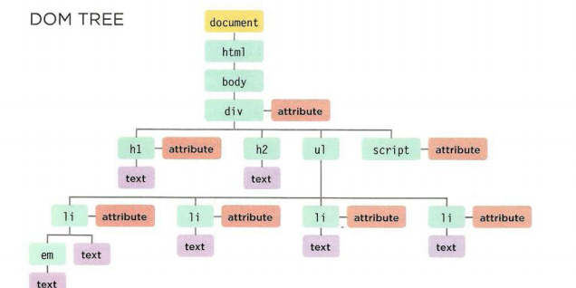
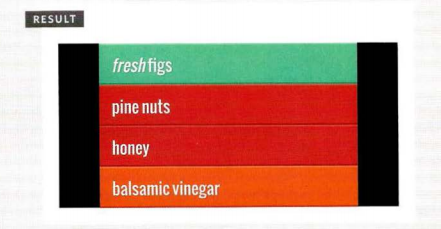
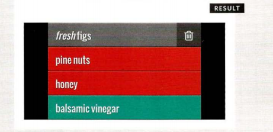
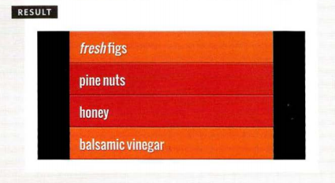

# Javascripts 
## Object Literals
#### WHAT IS AN OBJECT?
##### Objects group together a set of variables and functions to create a model of a something you would recognize from the real world. In an object,variables and functions take on new names. 
##### 1. Variables: IN AN OBJECT: VARIABLES BECOME KNOWN AS PROPERTIES, If a variable is part of an object, it is called a property. Properties tell us about the object, such as the name of a hotel or the number of rooms it has. Each individual hotel might have a different name and a different number of rooms.
##### 2. Functions: IN AN OBJECT: FUNCTIONS BECOME KNOWN AS METHODS, If a function is part of an object, it is called a method. Methods represent tasks that are associated with the object. For example, you can check how many rooms are available by subtracting the number of booked rooms from the total number of rooms.

### CREATING· OBJECTS USING LITERAL NOTATION

##### This example starts by creating an object using literal notation.
##### This object is called hotel which represents a hotel called Quay with 40 rooms (25 of which have been booked).
##### Next, the content of the page is updated with data from this object. It shows the name of the hotel by accessing the object's name property and the number of vacant rooms using the checkAvail ability() method.

##### To access a property of this object, the object name is followed by a dot (the period symbol) and the name of the property that you want.

##### Similarly, to use the method, you can use the object name followed by the method name. hotel . checkAvailability()

##### If the method needs parameters, you can supply them in the parentheses (just like you can pass arguments to a function). 

```
Javascript

var hotel = {
name: 'Quay',
rooms: 40,
booked : 25,
checkAvailability: function() {
return this.rooms - this.booked;
}
} ;
JAVASCRIPT
var el Name = document .getElementByld('hotelName');
elName.textContent =hotel .name;
var elRooms = document.getElementByid{'rooms');
elRooms.textContent = hotel .checkAvailability();
```

### CREATING MORE OBJECT LITERALS

##### Here you can see another object. Again it is called hote 1, but this time the model represents a different hotel. For a moment, imagine that this is a different page of the same travel website.

##### The Park hotel is larger. It has 120 rooms and 77 of them are booked.

```
Javascript

var hotel = {
name: 'Park',
rooms: 120,
booked : 77,
checkAvailabi lity: function() {
return this.rooms - this.booked;
}
} ;
var elName = document .getElementByid('hotelName') ;
elName .textContent =hotel .name ;
var el Rooms = document .getElementByid( 'rooms') ;
e 1 Rooms . text Content = hote 1 . checkAvai l abi lity(); 
```

##### The only things changing in the code are the values of the hot e 1 object's properties:
* The name of the hotel
* How many rooms it has
* How many rooms are booked

##### The rest of the page works in exactly the same way. The name is shown using the same code. The checkAvai 1 abi l ity() method has not changed and is called in the same way.

##### If this site had 1,000 hotels, the only thing that would need to change would be the three properties of this object. Because we created a model for the hotel using data, the same code can access and display the details for any hotel that follows the same data model. 

_________________________________________________________________________________________________________________________________________

------------------------------------------------------------------------


## Document object model 

##### Document Object Model (DOM) specifies how browsers should create a model of an HTML page and how JavaScript can access and update the contents of a web page while it is in the browser window. 

#### The DOM is neither part of HTML, nor part of JavaScript; it is a separate set of rules. It is implemented by all major browser makers, and covers two primary areas: 
##### MAKING A MODEL OF THE HTML PAGE When the browser loads a web page, it creates a model of the page in memory.
##### The DOM specifies the way in which the browser should structure this model using a DOM tree.
##### The DOM is called an object model because the model (the DOM tree) is made of objects.
##### Each object represents a different part of the page loaded in the browser window

### ACCESSING AND CHANGING THE HTML PAGE
##### The DOM also defines methods and properties to access and update each object in this model, which in turn updates what the user sees in the browser.
##### You will hear people call the DOM an Application Programming Interface (API). User interfaces let humans interact with programs; APls let programs (and scripts) talk to each other. The DOM states what your script can "ask the browser about the current page, and how to tell the browser to update what is being shown to the user.

#### THE DOCUMENT NODE
##### Above, you can see the HTML code for a shopping list, and on the right hand page is its DOM tree. Every element, attribute, and piece of text in the HTML is represented by its own DOM node. At the top of the tree a document node is added; it represents the entire page (and also corresponds to the document object, which you first met on p36). When you access any element, attribute, or text node, you navigate to it via the document node. It is the starting point for all visits to the DOM tree. 

#### ELEMENT NODES
##### HTML elements describe the structure of an HTML page. `(The <h l > - <h6>` elements describe what parts are headings; the `<p>` tags indicate where paragraphs of text start and finish; and so on.) To access the DOM tree, you start by looking for elements. Once you find the element you want, then you can access its text and attribute nodes if you want to. This is why you start by learning methods that allow you to access element nodes, before learning to access and alter text or attributes.
#### Each node is an object with methods and properties.
##### Scripts access and update this DOM tree (not the source HTML file).
##### Any changes made to the DOM tree are reflected in the browser. 



#### ATTRIBUTE NODES 
##### The opening tags of HTML elements can carry attributes and these are represented by attribute nodes in the DOM tree. Attribute nodes are not children of the element thar carries them; they are part of that element. Once you access an element, there are specific JavaScript methods and properties to read or change that element's attributes. For example, it is common to change the values of cl ass attributes to trigger new CSS rules that affect their presentation. 

#### TEXT NODES
##### Once you have accessed an element node, you can then reach the text within that element. This is stored in its own text node. Text nodes cannot have children. If an element contains text and another child element, the child element is not a child of the text node but rather a child of the containing element. (See the `<em>` element on the first `<l i > item.)` This illustrates how the text node is always a new branch of the DOM tree, and no further branches come off of it.
----------------------------------------

### SELECTING ELEMENTS USING ID ATTRIBUTES

##### get ElementByid () allows youto select a single element node by specifying the value of its id attribute.

##### This method has one parameter: the value of the id attribute onthe element you want to select. This value is placed inside quote marks because it is a string. The quotes can be single or double quotes, but they must match.

#### example: 
```
html

<hl id="header">List King<lhl>
<h2>Buy groceries<lh2>
<ul>
<li id="one" class="hot"><em>fresh<lem>
figs<lli>
<li id="two" class="hot">pine nuts<lli>
<li id="three" class="hot">honey<lli>
<li id="four">balsamic vi negar<ll i>
</ul
```
```
Javascript

II Select the element and store it in a variable.
var el = document.getElementByid('one');
II Change the value of the class attribute.
el.className ='cool ' ; 
```


________________________________________________


### TRAVERSING THE DOM

##### When you have an element node, you can select another element in relation to it using these five properties. This is known as traversing the DOM. 
#### parentNode
##### This property finds the element node for the containing (or parent) element in the HTML. (1) If you started with the first `<l i >element`, then its parent node would be the one representing the `<ul >element.`

#### previousSibling
#### nextSibling
##### These properties find the previous or next sibling of a node if there are siblings. If you started with the first `<1 i >`element, it would not have a previous sibling. However, its next sibling (2) would be the node representing the second `<l i >`

#### firstChild
#### lastChild
##### These properties find the first or last child of the current element. If you started with the `<u 1 >` element, the first child would bethe node representing the first `<l i>` element, and (3) the last child would be the last `<1 i >`.

________________________________________

## CREATING ATTRIBUTES & CHANGING THEIR VALUES 

```
Javascript

var firstltem = document.getElementByld('one'); II Get the first item
firstltem .className = 'complete '; II Change its class attribute
var fourthlt em = document.getElementsByTagName('li ').item(3);ll Get fourth item
el2.setAttribute('class' , ' cool'); II Add an attribute to it
```



---------------------------------------

## REMOVING ATTRIBUTES 
##### To remove an attribute from an element, first select the element, then call removeAttribute () . It has one parameter: the name of the attribute to remove.
##### Trying to remove an attribute that does not exist will not cause an error, but it is good practice to check for its existence before attempting to remove it.

```
Javascript

var firstltem = document .getElementByld{'one '); // Get the first i tem
if (firstltem.hasAttribute('class')) { //
firstlt em.removeAttri bute( ' cl ass' ); //
If it has a class attri bute
Remove its cl ass attribute 

```


________________________________________________
___________________________________________


#### all of this info in this readnote taken from javascript_and_jquery_interactive 

References: 
[javascriptBook](https://slack-files.com/files-pri-safe/TNGRRLUMA-F0203BL41FV/javascript_and_jquery_interactive_jon_du.pdf?c=1619819820-67b52b16b637b19a)