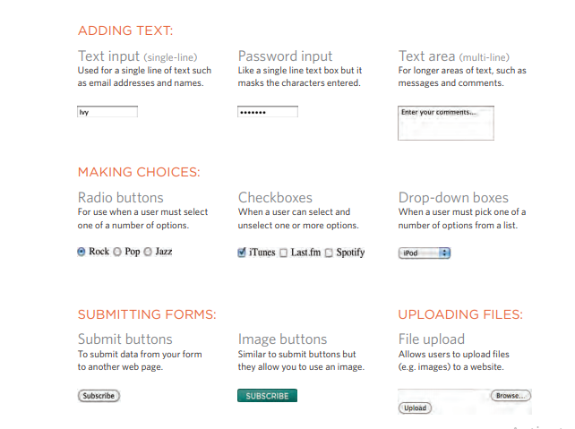

# forms
###  the term 'form' has referred to a printed document that contains spaces for you to fill in information.
#### HTML borrows the concept of a form to refer to different elements that allow you to collect information from visitors to your site.
#### Whether you are adding a simple search box to your website or you need to create more complicated insurance applications, HTML forms give you a set of elements to collect data from your users. 

## Why Forms? 
#### The best known form on the web is probably the search box that sits right in the middle of Google's homepage.

### Form Controls
#### There are several types of form controls that you can use to collect information from visitors to your site.



--------------------------------------------------------------------------------------


## Lists , Tables and forms 
#### There are several CSS properties that were created to work with specific types of HTML elements, such as lists, tables, and forms.

#### bullet point styles
#### The list-style-type property allows you to control the shape or style of a bullet point (also known as a marker). It can be used on rules that apply to the `<ol>, <ul>, and <li>` elements.

### Unordered Lists For an unordered list you can use the following values:
` none
 disc
 circle
 square`
#### Ordered Lists For an ordered (numbered) list you can use the following 
### values: decimal  `1 2 3`
### decimal-leading-zero `01 02 03`
### lower-alpha `a b c`
### upper-alpha `A B C`
### lower-roman `i. ii. iii.`
### upper-roman `I II III`

```
HTML

<h1>The Complete Poems</h1>
<h2>Emily Dickinson</h2>
<ol>
<li>Life</li>
<li>Nature</li>
<li>Love</li>
<li>Time and Eternity</li>
<li>The Single Hound</li>
</ol>
```

```
CSS
ol {
list-style-type: lower-roman;}
```

------------------------------------------------------------------------------
----------------------------------------------------------------------------

## Events
##### When you browse the web, your browser registers different types of events. It's the browser's way of saying, "Hey, this just happened." Your script can then respond to these events.


#### Scripts often respond to these events by updating the content of the web page (via the Document Object Model) which makes the page feel more interactive. In this chapter, you will learn how:

