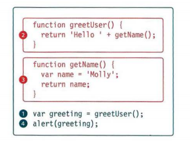

# Error Handling & Debugging
### ORDER OF EXECUTION 
#### To find the source of an error, it helps to know how scripts are processed. The order in which statements are executed can be complex; some tasks cannot complete until another statement or function has been run: 



#### This script above creates a greeting message, then writes it to an alert box (see right-hand page). In order to create that greeting, two functions are used: greetUser () and getName () .
#### You might think that the order of execution (the order in which statements are processed) would be as numbered: one through to four. However, it is a little more complicated.
#### To complete step one, the interpreter needs the results of the functions in steps two and three (because the message contains values returned by those functions). The order of execution is more like this: 1, 2, 3, 2, 1, 4.
```
1. The greeting variable gets its value from the greetUser() function.
2. greetUser() creates the message by combining the string 'He 11 o ' with the result of getName ().
3. getName () returns the name to greetUser().
2. greetUser() now knows the name, and combines it with the string. It then returns the message to the statement that called it in step 1.
1. The value of the greeting is stored in memory.
4. This greeting variable is written to an alert box
```

## EXECUTION CONTEXTS
#### The JavaScript interpreter uses the concept of execution contexts.
#### There is one global execution context; plus, each function creates a new execution context. They correspond to variable scope

#### EXECUTION CONTEXT
```
Every statement in a script lives in one of three
execution contexts:
Q GLOBAL CONTEXT
Code that is in the script, but not in a function.
There is only one global context in any page.
FUNCTION CONTEXT
Code that is being run within a function.
Each function has its own function context.
Q EVAL CONTEXT (NOT SHOWN)
Text is executed like code in an internal function
called eval {) (which is not covered in this book). 
```

#### VARIABLE SCOPE
```
The first two execution contexts correspond with the
notion of scope (which you met on p98):
Q GLOBAL SCOPE
If a variable is declared outside a function, it can
be used anywhere because it has global scope.
If you do not use the var keyword when creating
a variable, it is placed in global scope.
FUNCTION-LEVEL SCOPE
When a variable is declared within a function,
it can only be used within that function. This is
because it has function-level scope. 
```

#### ERROR OBJECTS 
##### Error objects can help you find where your mistakes are and browsers have tools to help you read them. 

#### When an Error object is created, it will contain the following properties:

#### There are seven types of built-in error objects in JavaScript.


## ERROR OBJECTS CONTINUED 
### Syntax Error
### SYNTAX IS NOT CORRECT
#### This is caused by incorrect use of the rules of the language. It is often the result of a simple typo.
### MISMATCHING OR UNCLOSED QUOTES
`document .write ("Howdyl );`
### SyntaxError: Unexpected EOF
### MISSING CLOSING BRACKET
```
document .getElementByid('page' I
SyntaxErr or : Expected token ' ) '
MISSING COMMA IN ARRAY
Would be same for missing] at the end
var l ist = ['Item 1', 'Item 2 ' l 'rtem 3'];
SyntaxError: Expected token ']'
MALFORMED PROPERTY NAME
It has a space but is not surrounded by quote marks
user = {f i rstl name: "Ben", lastName: "Lee"};
Synt axError: Expected an identifier but
found 'name ' instead
```
### ReferenceError
```
VARIABLE DOES NOT EXIST
This is caused by a variable that is not declared or is
out of scope.
VARIABLE IS UNDECLARED
var width = 12 ;
var area = width * llt!ftNU! ;
ReferenceError: Can ' t find vari able:
height
NAMED FUNCTION IS UNDEFINED
document.write ( randomFunction() ) ;
ReferenceError: Can't find variable :
randomFunctio
```

## HOW TO DEAL WITH ERRORS 
#### 1: DEBUG THE SCRIPT TO FIX ERRORS
#### If you come across an error while writing a script (or when someone reports a bug), you will need to debug the code, track down the source of the error, and fix it.
#### You will find that the developer tools available in every major modern browser will help you with this task. In this chapter, you will learn about the developer tools in Chrome and Firefox. (The tools in Chrome are identical to those in Opera.) IE and Safari also have their own tools (but there is not space to cover them all). 

#### 2: HANDLE ERRORS GRACEFULLY
#### You can handle errors gracefully using try, catch, throw, and fina1ly statements. 
#### Sometimes, an error may occur in the script for a reason beyond your control. For example, you might request data from a third party, and their server may not respond. In such cases, it is particularly important to write error-handling code.

#### In the latter part of the chapter, you will learn how to gracefully check whether something will work, and offer an alternative option if it fails.


## References :
### I made this reading note relying on : javascript_and_jquery_interactive Book. 