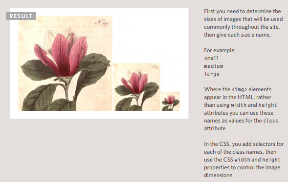

# Images 
### Controlling the size and alignment of your images using CSS keeps rules that affect the presentation of your page in the CSS and out of the HTML markup

## controlling sizes of images in css 

#### You can control the size of an image using the width and height properties in CSS, just like you can for any other box.

#### Specifying image sizes helps pages to load more smoothly because the HTML and CSS code will often load before the images, and telling the browser how much space to leave for an image allows it to render the rest of the page without waiting for the image to download.

#### You might think that your site is likely to have images of all different sizes, but a lot of sites use the same sized image across many of their pages. 

```
HTML


 ```

 ```
 CSS

 img.large {
width: 500px;
height: 500px;}
img.medium {
width: 250px;
height: 250px;}
img.small {
width: 100px;
height: 100px;}
```


--------------------------------------
## Important 

## Aligning images in CSS 
####  1. The float property is added to the class that was created to represent the size of the image (such as the small class in our example).
#### 2. New classes are created with names such as align-left or align-right to align the images to the left or right of the page. These class names are used in addition to classes that indicate the size of the image.

#### In this example you can see the align-left and align-right classes used to align the image. It is also common to add a margin to the image to ensure that the text does not touch their edges.

```
HTML

<p>
 <b><i>Magnolia</i></b> is a large genus that
 contains over 200 flowering plant species...</p>
<p>
Some magnolias, such as <i>Magnolia stellata</i>
 and <i>Magnolia soulangeana</i>, flower quite
 early in the spring before the leaves open...</p>
 ```

 ```
 CSS
 img.align-left {
float: left;
margin-right: 10px;}
img.align-right {
float: right;
margin-left: 10px;}
img.medium {
width: 250px;
height: 250px;}
```


__________________________________________________________________________________
-----------------------------------------------------------------------------------

## Practical Information
#### To wrap up the book we are going to look at some practical information that will help you launch a successful site.
### Search Engine Optimization (SEO)
### SEO is a huge topic and several books have been written on the subject. The following pages will help you understand the key concepts so you can improve your website's visibility on search engines.

### The Basics
#### Search engine optimization (or SEO) is the practice of trying to help your site appear nearer the top of search engine results when people look for the topics that your website covers.

### On-Page Techniques
#### On-page techniques are the methods you can use on your web pages to improve their rating in search engines.

### Off-Page Techniques
#### Getting other sites to link to you is just as important as on-page techniques. Search engines help determine how to rank your site by looking at the number of other sites that link to yours.


### How Many People Are Coming to Your Site?

### Visits
#### This is the number of times people have come to your site. If someone is inactive on your site for 30 minutes and then looks at another page on your site, it will be counted as a new visit.

### Unique Visits
#### This is the total number of people who have visited your site over the specified period. The number of unique visits will be lower than the number of visits if people have been returning to your site more than once in the defined period.


* ### Page Views 
   * The total number of pages all visitors have viewed on your site.

* ### Pages per Visit
   * The average number of pages each visitor has looked at on your site per visit.

* Average Time on Site
  * The average amount of time each user has spent on the site per visit.